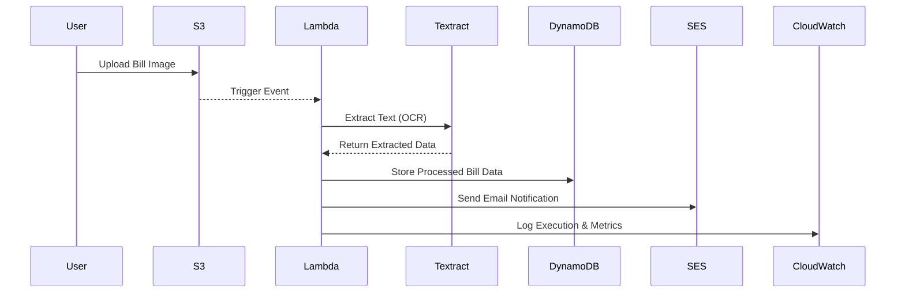

# 📄 Automated Bill Processing System (AWS)

## 🚀 Overview

The **Automated Bill Processing System** is a fully **serverless, event-driven solution** built on AWS.
It automates the process of extracting information from uploaded bill images, storing the structured data, and sending confirmation emails — all without the need for a traditional backend or frontend application.

This project demonstrates **cloud-native design principles**, **serverless automation**, and **scalable data processing** using AWS managed services.

---

## 📸 Architecture Diagram  


---

## ⚙️ Technologies & AWS Services

* **Amazon S3** → Stores raw bill images
* **AWS Lambda** → Event-driven serverless compute
* **Amazon Textract** → OCR for extracting text from bills
* **Amazon DynamoDB** → NoSQL database for structured bill data
* **Amazon SES** → Sends automated email notifications
* **Amazon CloudWatch** → Logs, metrics, and monitoring
* **AWS CloudTrail** → API activity auditing

---

## ✨ Key Features

* 📤 **Automated Upload & Trigger** → Bills processed as soon as uploaded
* 🧠 **OCR Integration** → Extracts key fields (amount, date, vendor, etc.)
* 📂 **Serverless Storage** → DynamoDB for structured data
* 📧 **Email Notifications** → SES sends confirmation emails automatically
* 📊 **Monitoring & Logs** → CloudWatch for debugging and alarms
* 🔒 **Scalable & Secure** → Built entirely on AWS managed services

---

## 🔄 Workflow



---

## 📌 Project Status

* ✅ Implemented as a **2-tier serverless architecture** (Application + Data).
* 🚧 Planned upgrade into a **3-tier system** with a frontend dashboard and API Gateway.

---

## 🔮 Future Enhancements

* Add a **React-based dashboard** for uploading and viewing bills
* Expose APIs via **Amazon API Gateway** for external integrations
* Integrate **Amazon Comprehend** to validate and categorize bill data
* Add a **Cost Analysis Module** to track and summarize spending trends
* Enable **SNS notifications** (SMS/push alerts)

---

## 📂 Repository Structure

```bash
.
├── /lambda_functions    # AWS Lambda function code
├── /docs                # Architecture diagrams & documentation
├── README.md            # Project documentation
└── /sample_bills        # Example bill images for testing
```

---

## 🛠️ Setup & Deployment

1. **Create an S3 Bucket** for bill uploads.
2. **Configure Lambda Function** to trigger on S3 uploads.
3. **Integrate Textract** within the Lambda to extract text.
4. **Save output** to DynamoDB.
5. **Verify emails** in SES and set as recipients.
6. **Enable CloudWatch** for logging and monitoring.

---

## 📊 Monitoring & Security

* **CloudWatch** → Logs Lambda executions and sets up alarms for errors.
* **CloudTrail (optional)** → Tracks API activity for auditing and compliance.

---

## 🎥 Demo  

  
*Bill uploaded to S3*  

  
*Textract output stored in DynamoDB*  

  
*Processed bill details sent via SES*  


## 🧑‍💻 Author  

**Satwik Yadav** — B.Tech CSE Student | Aspiring SDE (Java) | Cloud & AWS Enthusiast  

